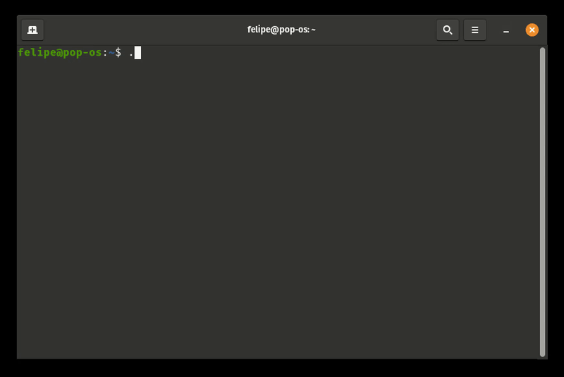

# dummy-rs

A command-line tool for creating dummy files of specific sizes, useful for testing storage capabilities, file transfer speeds, or simulating data.

## Features

- Create files of specific sizes (from bytes to gigabytes)
- Fill with zeros (default) or random data
- Display progress bar during creation
- Measure and report write speed

## Installation

### Building from source

```bash
# Clone the repository
git clone https://github.com/your-username/dummy-rs.git
cd dummy-rs

# Build the project
cargo build --release

# The binary will be available at target/release/dummy-rs
```

## Usage

```bash
# Basic syntax
dummy-rs <FILE> <SIZE> [--fill]
```

### Parameters

- `<FILE>`: Name or path of the file to be created
- `<SIZE>`: Size of the file to be created, with suffix support:
  - No suffix: size in bytes (e.g., 1024)
  - K: Kilobytes (e.g., 10K = 10 * 1024 bytes)
  - M: Megabytes (e.g., 100M = 100 * 1024 * 1024 bytes)
  - G: Gigabytes (e.g., 1G = 1 * 1024 * 1024 * 1024 bytes)
- `--fill`: Optional. If provided, fills the file with random data instead of zeros

### Examples

```bash
# Create a 10MB file filled with zeros
dummy-rs file.dat 10M

# Create a 1GB file filled with random data
dummy-rs large_file.bin 1G --fill

# Create a file of exactly 1024 bytes
dummy-rs small.dat 1024
```



## Benchmark

Upon completing the file creation, `dummy-rs` will display performance statistics:

- File size
- Elapsed time for creation
- Write speed in MB/s

## Requirements

- Rust 1.87.0 or higher

## License

This project is licensed under the [MIT License](LICENSE).
